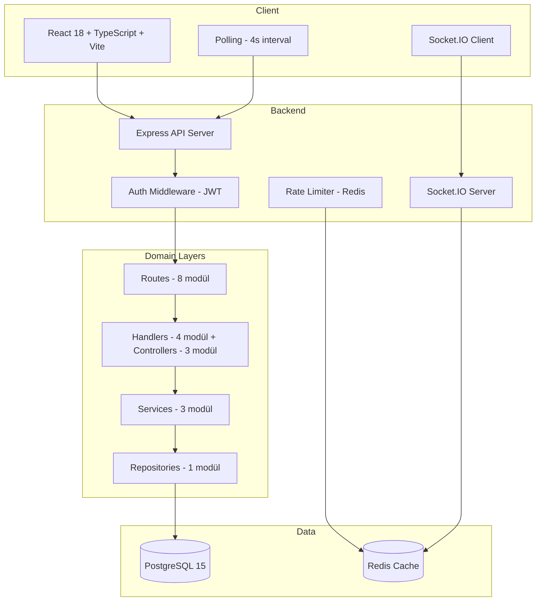

# CafeDuo Expert Review Report

**Tarih:** 24 Şubat 2026  
**Kapsam:** Tüm codebase — Backend, Frontend, DevOps, Güvenlik, Mimari  
**Versiyon:** 1.0.0  
**Canlı:** https://cafeduotr.com

---

## 1. Genel Değerlendirme

CafeDuo, üniversite çevresindeki kafeler için oyunlaştırılmış sadakat platformu olarak iyi kurgulanmış bir fullstack projedir. React 18 + TypeScript frontend, Node.js/Express backend, PostgreSQL veritabanı, Redis cache, ve Socket.IO realtime altyapısıyla modern bir tech stack kullanılmaktadır.

### Güçlü Yönler

**Mimari olgunluk düzeyi: Orta-İleri.** Proje, birçok açıdan production-ready kalitede yapılandırılmıştır:

- Route/Handler/Service/Repository katman ayrımı başlamış ve oyun domaini için büyük ölçüde tamamlanmış
- Formal Game State Machine (`waiting → active → finishing → finished`) dokümante edilmiş ve koda yansımış
- OpenAPI 3.0 spesifikasyonu 1672 satırlık kapsamlı bir API sözleşmesi
- ADR (Architecture Decision Records) ile kararlar kayıt altına alınmış
- Jest + Playwright + Smoke test katmanları mevcut
- Docker + Docker Compose ile containerized deployment hazır
- Redis-backed rate limiting ve structured logging (Winston)
- Detaylı bir 10 haftalık engineering roadmap hazırlanmış

---

## 2. Backend Analizi

### 2.1 Kod Organizasyonu

```
backend/
├── server.js          (865 satır — hâlâ büyük)
├── controllers/       (auth, cafe, store)
├── handlers/          (admin, commerce, game, profile)
├── services/          (email, gameMove, game)
├── repositories/      (game)
├── routes/            (admin, auth, cafe, commerce, game, profile, store, system)
├── validators/        (game)
├── middleware/         (auth, cache, errorContract, rateLimit)
├── jobs/              (gameCleanup)
├── utils/             (adminValidation, gameResults, gameStateMachine, geo, logger, routeHelpers)
├── config/            (redis)
└── store/             (memoryState)
```

**Olumlu:**
- Route → Handler → Service → Repository katmanlı mimari oyun domaini için kurulmuş
- `gameStateMachine.js` ile formal state transition guard fonksiyonları
- `gameValidators.js` ile kapsamlı request validation (chess move, live submission, score submission)
- `errorContract.js` ile unified error format (`code`, `message`, `details`, `requestId`)
- `gameMoveService.js` ile transaction-safe hamle işleme (SELECT FOR UPDATE)
- Idempotency key (`submissionKey`) ile çift submit koruması
- Redis-backed rate limiting farklı scope'larda (API genel, auth brute-force)

**Sorunlu / Geliştirilebilir:**

#### 🔴 P0 — server.js Hâlâ 865 Satır
`server.js` dosyası hâlâ route mounting, Socket.IO setup, CORS konfigürasyonu, game type normalization, admin email parsing gibi cross-cutting concern'leri barındırıyor. `normalizeGameType()`, `normalizeTableCode()` gibi utility fonksiyonları burada tanımlanıp handler'lara enjekte ediliyor.

**Öneri:** Bu fonksiyonlar `backend/utils/` altına taşınmalı; `server.js` yalnızca app bootstrap + middleware mount + server listen içermeli.

#### 🔴 P0 — gameHandlers.js 2231 Satır
Bu dosya projenin en büyük ve en riskli dosyası. Create, join, move, finish, resign, draw-offer, delete, getState, getHistory gibi tüm oyun endpoint logic'ini barındırıyor. `gameMoveService.js`'e chess/live/score hamleleri taşınmış olsa da, handler katmanı hâlâ çok ağır.

**Öneri:** Her büyük handler fonksiyonu (`createGame`, `joinGame`, `finishGame`, `drawOffer`, `resignGame`) kendi service modülüne ayrılmalı.

#### 🟡 P1 — In-Memory Fallback Her Yerde Duplike
Veritabanı bağlantısı yokken in-memory fallback kullanılıyor (`if (await isDbConnected()) { ... } else { memory fallback ... }`). Bu pattern her handler ve service dosyasında tekrarlanıyor ve her yeni özellik eklenmesinde iki paralel path'in test edilmesi gerekiyor.

**Öneri:** In-memory modu ya tamamen kaldırılmalı (production'da DB zorunlu) ya da repository pattern ile abstract edilmeli (MemoryGameRepository vs PostgresGameRepository).

#### 🟡 P1 — Controller vs Handler Tutarsızlığı
`controllers/` ve `handlers/` dizinleri aynı sorumluluktaki kodlar için iki farklı isim kullanıyor. Auth, Cafe, Store `controllers/` altında; Admin, Commerce, Game, Profile ise `handlers/` altında.

**Öneri:** Tek bir isimlendirme standardına geçilmeli.

#### 🟡 P1 — Eksik Repository'ler
Yalnızca `gameRepository.js` mevcut. User, Cafe, Reward, Achievement gibi diğer domain'ler için repository yok — SQL sorguları doğrudan controller/handler'lardan çalıştırılıyor.

**Öneri:** Her domain entity'si için dedike repository oluşturulmalı.

### 2.2 Veritabanı Katmanı

**Olumlu:**
- `pgvector/pgvector:pg15` image kullanımı (ileride vector search potansiyeli)
- Connection retry logic ve health check mevcut
- `SELECT ... FOR UPDATE` ile concurrent game join koruması
- DB status caching ile gereksiz connection check'i önleniyor

**Sorunlu:**

#### 🔴 P0 — Eksik Database Migration Sistemi
Şu anda `schema.sql` dosyası Docker entrypoint'te çalıştırılıyor. Resmi bir migration aracı (Knex, Prisma, node-pg-migrate) yok.

**Öneri:** Migration sistemi kurulmalı; indeks ekleme, schema değişikliği güvenli yapılabilmeli.

#### 🟡 P1 — Pool Konfigürasyonu Eksik
`db.js` içinde connection pool için `max`, `idleTimeoutMillis`, `connectionTimeoutMillis` gibi parametreler ayarlanmamış. Yoğun trafik altında pool exhaustion riski mevcut.

**Öneri:** Production için pool boyutu ve timeout'lar açıkça konfigüre edilmeli.

---

## 3. Frontend Analizi

### 3.1 Kod Organizasyonu

```
Frontend kök dizin:
├── App.tsx           (router + providers + auth state)
├── components/       (30+ component)
├── hooks/            (useGames, useRewards, useCafeAdmin, useCafeSelection)
├── lib/              (api, socket, multiplayer, gameAssets, chunkLoad, etc.)
├── contexts/         (AuthContext, ToastContext)
├── e2e/              (Playwright tests)
└── public/           (assets, manifest)
```

**Olumlu:**
- TypeScript ile güçlü tip güvenliği
- Custom hooks ile logic extraction (`useGames`, `useRewards`)
- `lazyWithRetry` ile chunk loading hata yönetimi
- Page transition animations (Framer Motion)
- Socket.IO + polling hybrid realtime approach
- `ErrorBoundary` ile crash protection
- PWA hazırlığı (manifest.json, offline fallback component)
- Kapsamlı test dosyaları (her component'in `.test.tsx` karşılığı)

**Sorunlu / Geliştirilebilir:**

#### 🔴 P0 — AuthContext ve App.tsx Arasında Çift Auth State
`AuthContext.tsx` bir auth provider sunuyor (`useAuth()` hook ile) ama `App.tsx` kendi içinde ayrı bir `currentUser`, `isLoggedIn`, `authHydrating` state yönetimine sahip. AuthContext wrapleniyor ama gerçek auth state'i `App.tsx`'den yönetiliyor. İki ayrı session restore mantığı çalışıyor.

**Öneri:** Auth state tek yerde yönetilmeli — ya AuthContext kullanılmalı ya da App.tsx state'i korunup context kaldırılmalı. Mevcut halde ikisi paralel çalışarak token verify'ı iki kez yapıyor.

#### 🟡 P1 — Polling-First Realtime Stratejisi
`useGames` hook'u 4 saniyede bir polling yapıyor. Socket.IO'dan gelen `lobby_updated` event'i sadece ek bir fetch trigger'ı olarak kullanılıyor — gerçek veri her zaman REST API'den çekiliyor. Bu yaklaşım basit ve güvenilir ama yüksek kullanıcı sayısında gereksiz API yükü yaratıyor.

**Öneri:** Socket event payload'una lobby diff veya full state eklenebilir; polling sıklığı azaltılarak socket-first yaklaşıma geçilebilir.

#### 🟡 P1 — Component Boyutları
`Dashboard.tsx` (594 satır) ve game component'leri geniş. Dashboard tab management, game result handling, glitch animation gibi birçok sorumluluğu barındırıyor.

**Öneri:** Dashboard'u daha küçük sub-component'lere bölmek; her tab için ayrı component kullanmak.

#### 🟡 P1 — Flat Component Dizini
30+ component tek seviye `components/` altında. `components/dashboard/` alt dizini başlamış ama çoğu component flat duruyor.

**Öneri:** Domain bazlı alt dizinler: `components/game/`, `components/auth/`, `components/admin/`, `components/cafe/`.

#### 🟢 P2 — PWA Desteği Askıda
`vite.config.ts` içinde PWA plugin'i Vite 7 uyumsuzluğu nedeniyle TODO olarak kapatılmış. Manifest.json ve OfflineFallback component'i hazır ama service worker aktif değil.

**Öneri:** `vite-plugin-pwa` 0.22.0+ ile Vite 7 uyumluluğu sağlandığında aktifleştirilmeli.

---

## 4. Realtime ve Oyun Motoru Analizi

### 4.1 Socket.IO Katmanı

**Olumlu:**
- `join_game` / `game_move` / `update_game_state` event'leri tanımlı
- Room bazlı yayın (`socket.to(gameId).emit(...)`)
- Input sanitization (gameId max 64 char, move data truncation)

**Sorunlu:**

#### 🔴 P0 — Socket Bağlantısında Auth Yok
`lib/socket.ts` içinde socket bağlantısı auth token olmadan kuruluyor. Herhangi bir istemci socket sunucusuna bağlanıp herhangi bir game room'a join olabilir ve game_move event'leri gönderebilir.

```typescript
// Mevcut: Auth yok
this.socket = io(SOCKET_URL, {
    withCredentials: true,
    autoConnect: true,
    reconnection: true,
});
```

**Öneri:** Socket bağlantısı sırasında JWT token gönderilmeli; backend tarafında socket middleware ile verify edilmeli.

#### 🟡 P1 — Socket.IO Redis Adapter Eksik
Tek instance çalışırken sorun yok ama scale-out için Socket.IO Redis adapter gerekli. Roadmap'te Sprint 6'da planlanmış ama henüz uygulanmamış.

**Öneri:** `@socket.io/redis-adapter` eklenmeli.

#### 🟡 P1 — Reconnect Sonrası State Replay Yok
Socket kopup yeniden bağlandığında mevcut oyun state'i yeniden yüklenmek yerine sadece yeni event'ler alınıyor. Geçiş sırasında kaçırılan event'ler kaybolabilir.

**Öneri:** Reconnect callback'inde son game state fetch edilmeli.

### 4.2 Oyun State Machine

**Olumlu:**
- Formal state machine (`waiting → active → finishing → finished`)
- Guard fonksiyonları ile geçersiz geçişler engelleniyor
- Her move handler'da `assertRequiredGameStatus` çağrısı
- Chess clock server-side doğrulama ve timeout detection
- Detaylı dokümantasyon (`docs/game-state-machine.md`)

**Sorunlu:**

#### 🟡 P1 — `finishing` State Kullanılmıyor
State machine'de `finishing` state tanımlı ve geçişleri kurgulanmış ama kodda hiçbir yerde bir oyun `finishing` state'ine geçirilmiyor. Tüm finalizasyonlar doğrudan `active → finished` yapıyor.

**Öneri:** Ya `finishing` state'i kaldırılmalı ya da asenkron finalize pipeline'ı oluşturulmalı.

---

## 5. Güvenlik Analizi

### 5.1 Olumlu Güvenlik Uygulamaları

- JWT ile token-based auth; refresh yoksa bile verify middleware sağlam
- `JWT_SECRET` yoksa uygulama başlamayı reddediyor (hard fail)
- Bcrypt ile password hashing
- Helmet middleware ile güvenli HTTP header'ları
- Redis-backed rate limiting (scope bazlı: API genel, auth login, auth register)
- CORS origin whitelist
- Request ID ile tüm log'larda korelasyon
- Token boyut limiti (max 2048 char)
- Google reCAPTCHA desteği
- Input validation (game validators ile kapsamlı)
- `FOR UPDATE` ile race condition koruması

### 5.2 Güvenlik Riskleri

#### 🔴 P0 — Socket.IO Auth Eksikliği
Yukarıda detaylandırıldı. Herhangi bir istemci game room'a katılıp event dinleyebilir/gönderebilir.

#### 🟡 P1 — Refresh Token Mekanizması Yok
JWT token süresi dolduktan sonra kullanıcı tekrar login olmak zorunda. Refresh token rotasyonu olmadığı için token çalınması durumunda kullanıcı `JWT_EXPIRES_IN` süresince korumasız kalıyor.

**Öneri:** Refresh token + access token çift mekanizması veya token rotation uygulanmalı.

#### 🟡 P1 — Logout Server-Side Token Invalidation Yok
`api.auth.logout()` yalnızca localStorage'dan token'ı siliyor. Server tarafında token blacklist veya session invalidation yok. Çalınan bir token, expire olana kadar geçerli kalır.

**Öneri:** Redis-based token blacklist uygulanmalı.

#### 🟡 P1 — CSRF Koruması Yok
Uygulama SPA olduğu ve JWT Bearer token kullandığı için klasik CSRF riski düşük ama `withCredentials: true` ile cookie gönderimi açık. Eğer ileride session cookie eklenirse CSRF koruması gerekecek.

#### 🟢 P2 — Dependency Audit
`package.json` içinde `@testsprite/testsprite-mcp` gibi MCP test dependency'si production dependencies'de. Ayrıca `nodemon` da production dependencies'de.

**Öneri:** `nodemon` ve test araçları `devDependencies`'e taşınmalı.

---

## 6. Performans Analizi

### 6.1 Olumlu

- Route bazlı lazy loading (`lazyWithRetry`)
- Redis cache middleware mevcut
- Polling sırasında `document.visibilityState === 'hidden'` kontrolü
- `isSameGameList` / `isSameHistory` ile gereksiz re-render önleme
- In-flight request guard'ları (aynı anda çift fetch engeli)
- API timeout (12 saniye) ile istemci tarafı koruma
- Request logging ile slow query detection (`REQUEST_LOG_SLOW_MS`)

### 6.2 Performans Riskleri

#### 🟡 P1 — Lobby Polling Ağırlığı
Her kullanıcı 4 saniyede bir `GET /api/games`, `GET /users/:username/active-game` çağrıyor. 50 eşzamanlı kullanıcıda saniyede ~25 API çağrısı demek. Lobby verisi Redis'ten cache'lenmeli.

**Öneri:** Lobby listesi Redis'e kısa TTL (2-3 saniye) ile cache'lenmeli; Socket.IO event'i ile invalidate edilmeli.

#### 🟡 P1 — Veritabanı İndeksleri
Roadmap'te Sprint 5'te planlanmış ama `games(status, table_code, created_at)`, `games(host_name, status)`, `games(guest_name, status)` gibi kritik indeksler henüz uygulanmamış gibi görünüyor.

**Öneri:** Migration sistemi ile birlikte indeksler acilen eklenmelidir.

#### 🟢 P2 — Frontend Bundle Analizi
Kaboom (game engine), chess.js, framer-motion, leaflet gibi ağır kütüphaneler bundle'da. Lazy loading var ama chunk split stratejisi optimize edilebilir.

**Öneri:** `rollup-plugin-visualizer` ile bundle analizi yapılmalı; kaboom ve leaflet gibi büyük paketler ayrı chunk'lara izole edilmeli.

---

## 7. Test ve Kalite Analizi

### 7.1 Test Coverage

```
Unit Tests:     Jest (backend + frontend)
Integration:    App.integration.test.tsx
E2E:            Playwright (auth, game, shop, mobile-ui, tank-multiplayer)
Smoke:          prod-smoke.mjs
Perf:           api-p95.mjs
```

**Olumlu:**
- Hemen her component ve handler için `.test` dosyası mevcut
- Playwright ile mobil UI testi dahil
- Smoke test script'i production'da çalıştırılabilir
- API P95 latency ölçümü mevcut

**Sorunlu:**

#### 🟡 P1 — CI/CD Pipeline Eksik
`.github/` dizini mevcut ama GitHub Actions workflow dosyası görünmüyor. `npm run test:ci` komutu tanımlı ama otomatik çalıştıran pipeline yok.

**Öneri:** PR'larda otomatik test + lint + type-check çalıştıran CI pipeline kurulmalı.

#### 🟡 P1 — TypeScript Strict Mode
`jest.config.js` ve proje genelinde TypeScript strict ayarları tam doğrulanamadı. Backend tamamen JavaScript.

**Öneri:** Backend'e TypeScript geçişi planlanmalı; en azından JSDoc + `@ts-check` ile tip güvenliği artırılmalı.

---

## 8. DevOps ve Deployment Analizi

### 8.1 Olumlu

- Docker + Docker Compose ile reproducible ortam
- Ayrı Dockerfile (backend) ve Dockerfile.web (frontend/nginx)
- Production docker-compose (`deploy/docker-compose.prod.yml`)
- Caddy reverse proxy konfigürasyonu
- Rollback script'i (`deploy/scripts/rollback.sh`)
- Smoke test script'i
- DB explain script'i
- Deploy script (expect-based SSH deploy)

### 8.2 Sorunlu

#### 🟡 P1 — docker-compose.yml `version` Deprecated
`version: '3.8'` artık Docker Compose v2'de deprecated. Fonksiyonel bir sorun yaratmaz ama uyarı verir.

**Öneri:** `version` key'i kaldırılmalı.

#### 🟡 P1 — `redis_data` Volume Kullanılmıyor
`volumes` bölümünde `redis_data` tanımlı ama redis service'inde mount edilmemiyor. Redis verileri container restart'ında kaybolur.

**Öneri:** Redis persistence gerekiyorsa volume mount edilmeli; gerekmiyorsa volume tanımı kaldırılmalı.

#### 🟢 P2 — Health Check Endpoint
Backend'de `/health` endpoint'i mevcut (`systemRoutes.js`) ama Docker healthcheck'te kullanılmıyor — sadece PostgreSQL ve Redis'in kendi healthcheck'leri var.

**Öneri:** API container'ına da HTTP health check eklenebilir.

---

## 9. Dokümantasyon Değerlendirmesi

### Olumlu
- Kapsamlı README.md (kurulum, test, deployment)
- 5 adet ADR (JWT, PostgreSQL, Socket.IO, TypeScript, RBAC)
- Game State Machine contract dokümanı
- Deployment runbook
- Performance tracking ve index dokümanları
- Sunum dosyaları (HTML + Markdown)
- Contributing guide ve Code of Conduct
- Detaylı engineering roadmap (ROADMAP_SENIOR.md)

### Geliştirilebilir
- API dokümanı Swagger UI ile servis edilmiyor
- `schema.sql` dosyası proje kökünde referans veriliyor ama listelenmiyor — ya migration sistemi ya da README'de schema bilgisi netleştirilmeli

---

## 10. Öncelikli Aksiyon Planı

### 🔴 P0 — Hemen Yapılmalı

| # | Aksiyon | Neden |
|---|---------|-------|
| 1 | Socket.IO auth middleware ekle | Güvenlik açığı — herkes game room'a girebilir |
| 2 | DB migration sistemi kur | Schema değişiklikleri güvenli ve tekrarlanabilir olmalı |
| 3 | App.tsx / AuthContext çift auth state'i birleştir | İki paralel token verify işlemi gereksiz network ve UX karmaşıklığı yaratıyor |
| 4 | `gameHandlers.js`'i parçala | 2231 satırlık dosya bakım ve test edilebilirlik için risk |

### 🟡 P1 — Sprint İçinde Yapılmalı

| # | Aksiyon | Neden |
|---|---------|-------|
| 5 | Lobby ve game sorgularına DB indeksleri ekle | P95 latency hedefi sağlanmalı |
| 6 | Redis cache ile lobby polling yükünü düşür | Scale bottleneck |
| 7 | Refresh token veya server-side session invalidation | Token çalınması durumunda koruma |
| 8 | CI/CD pipeline kur (GitHub Actions) | Her PR'da otomatik test |
| 9 | In-memory fallback'i repository pattern ile abstract et | Kod duplikasyonu azalır |
| 10 | Handler/Controller isimlendirme standardizasyonu | Tutarlılık |
| 11 | `server.js` utility fonksiyonlarını utils'e taşı | Single responsibility |
| 12 | Socket reconnect state replay mekanizması | Oyun kopması önleme |
| 13 | Pool konfigürasyonunu production-grade yap | Connection exhaustion riski |

### 🟢 P2 — Sonraki Döngülerde

| # | Aksiyon | Neden |
|---|---------|-------|
| 14 | Backend TypeScript geçişi | Tip güvenliği ve refactor kolaylığı |
| 15 | PWA service worker aktifleştirme | Offline deneyim |
| 16 | Bundle optimizasyonu (chunk split) | İlk yükleme performansı |
| 17 | Component dizin yapısını domain bazlı reorganize et | Bakım kolaylığı |
| 18 | `finishing` state'i implement et veya kaldır | Dead code riski |
| 19 | `nodemon` ve test-only package'ları devDependencies'e taşı | Temiz production build |
| 20 | Swagger UI ile API dokümanı servis et | Developer experience |

---

## 11. Mimari Genel Görünüm



---

## 12. Sonuç

CafeDuo, tek geliştiricili bir proje için oldukça olgun bir mimari sergilemektedir. Game state machine, validation katmanı, error contract, structured logging, ADR dokümanları ve 10 haftalık roadmap gibi bileşenler profesyonel yazılım mühendisliği pratiklerinin uygulandığını göstermektedir.

En kritik iyileştirme alanları sırasıyla: **Socket.IO auth eksikliği** (güvenlik), **migration sistemi yokluğu** (operasyonel risk), **çift auth state** (teknik borç) ve **gameHandlers.js boyutu** (bakım riski) olarak öne çıkmaktadır.

Roadmap'te tanımlanan hedefler (ROADMAP_SENIOR.md) mevcut durumla büyük ölçüde uyumlu olup, bu rapordaki öncelik sıralaması Roadmap'teki Faz A-E planıyla paralel ilerleyebilir. Socket auth konusu ise Roadmap'te açıkça yer almadığından, Faz E güvenlik sertleştirme bölümüne P0 olarak eklenmelidir.
